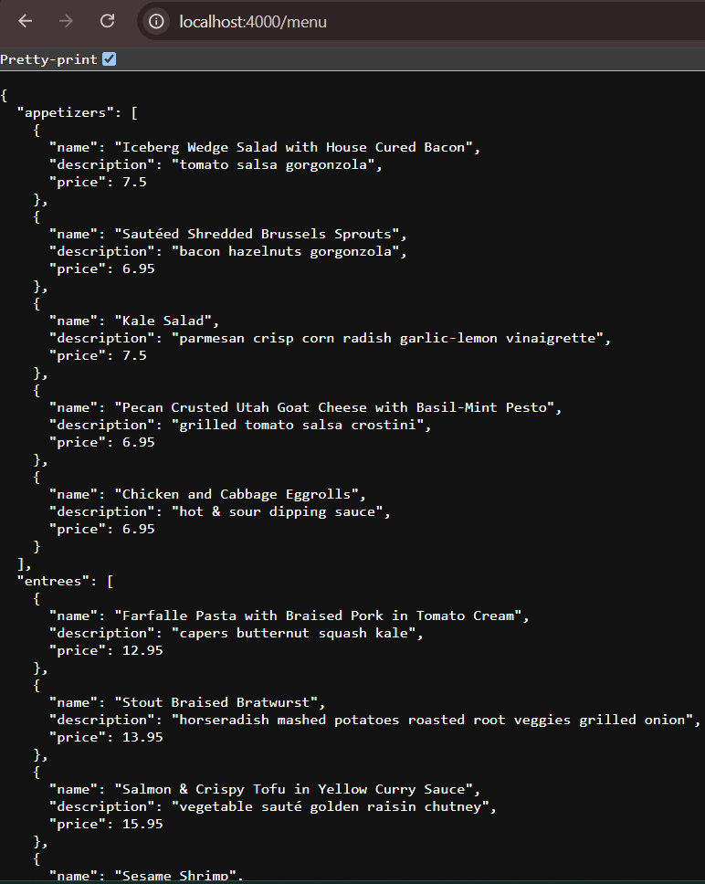
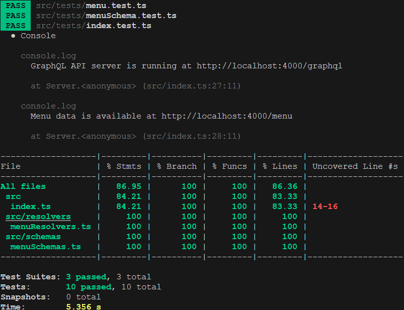

# Web Restaurant API

This project is a simple Node.js server built with TypeScript and GraphQL to provide a menu API. It includes endpoints for querying menu data via GraphQL as well as serving the data in JSON format. The project is designed to be modular and easy to test.

## Features

- **GraphQL API**: Query menu data with flexible GraphQL queries.
- **REST Endpoint**: Retrieve the full menu as JSON via a traditional REST endpoint.
- **TypeScript**: Strongly typed code for better development experience and maintainability.
- **Built-in Test Suite**: Test coverage for API functionality.

---

## Endpoints

### **Menu JSON Endpoint**

**URL**: `/menu`  
**Method**: `GET`  
**Description**: Returns the entire menu in JSON format.

#### Example Response

```json
{
  "appetizers": [
    {
      "name": "Iceberg Wedge Salad with House Cured Bacon",
      "description": "tomato salsa gorgonzola",
      "price": 7.5
    },
    {
      "name": "Sautéed Shredded Brussels Sprouts",
      "description": "bacon hazelnuts gorgonzola",
      "price": 6.95
    }
  ],
  "entrees": [
    {
      "name": "Farfalle Pasta with Braised Pork in Tomato Cream",
      "description": "capers butternut squash kale",
      "price": 12.95
    }
  ]
}
```

---
## Project Structure

```bash
.
├── resolvers/
│   ├── menuResolvers.ts   # Resolver functions for GraphQL
├── schemas/
│   ├── menuSchemas.ts     # GraphQL type definitions
├── tests/
│   ├── menu.test.ts       # Test file for the menu functionality
├── types/
│   ├── menuTypes.ts       # Defines TypeScript types for the menu structure
├── index.ts               # Main server code
├── .eslintrc.js           # ESLint configuration file
├── package.json           # Project dependencies and scripts
├── tsconfig.json          # TypeScript configuration
├── jest.config.js         # Configuration file for Jest testing framework
├── commitlint.config.js   # Configuration for commit message linting
├── .prettierrc            # Configuration file for Prettier code formatter
├── .travis.yml            # Configuration file for Travis CI (Continuous Integration)
├── nodemon.json           # Configuration file for Nodemon (used for development server reloading)
└── tslint.json            # TSLint configuration file (may be obsolete if ESLint is used)
```

---
## Getting Started

### Prerequisites

* Node.js(>= 16.x)
* npm or yarn

### Installation

1. Clone the repository:
```bash
  git clone https://github.com/angryBirdGuy/restaurant-menu.git
```

2. Install dependencies:
```bash
  npm install
```

3. Start the server:
```bash
  npm start
```
The server will run on http://localhost:4000

4. Run the tests:
```bash
  npm test
```

---

## Development

### Scripts
* ```npm start```: Runs the Server in production mode.
Below is the result.
<div align="left">
  
</div>

* ```npm test```: Runs the test suite.
Below is the test Result.
<div align="left">
  
</div>

### TypeScript
This project uses TypeScript for type safety and better development experience.
TypeScript configurations can be updated in ```tsconfig.json```.

---
## Testing

The project includes a test suite written in Jest. Tests cover the following functionality:
* Fetching menu data from ```/menu```.
* Sending valid and invalid GraphQL queries to ```/graphql```.

### Running Tests

 Run the following command to execute the tests:

 ```bash
 npm test
 ```

 ---